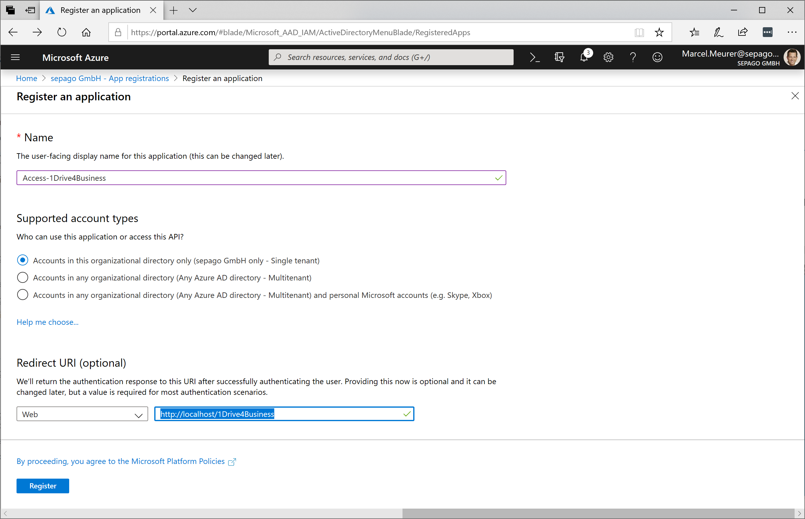
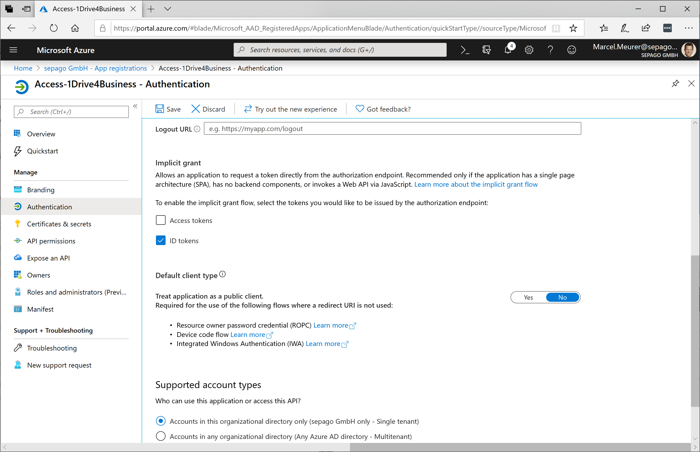
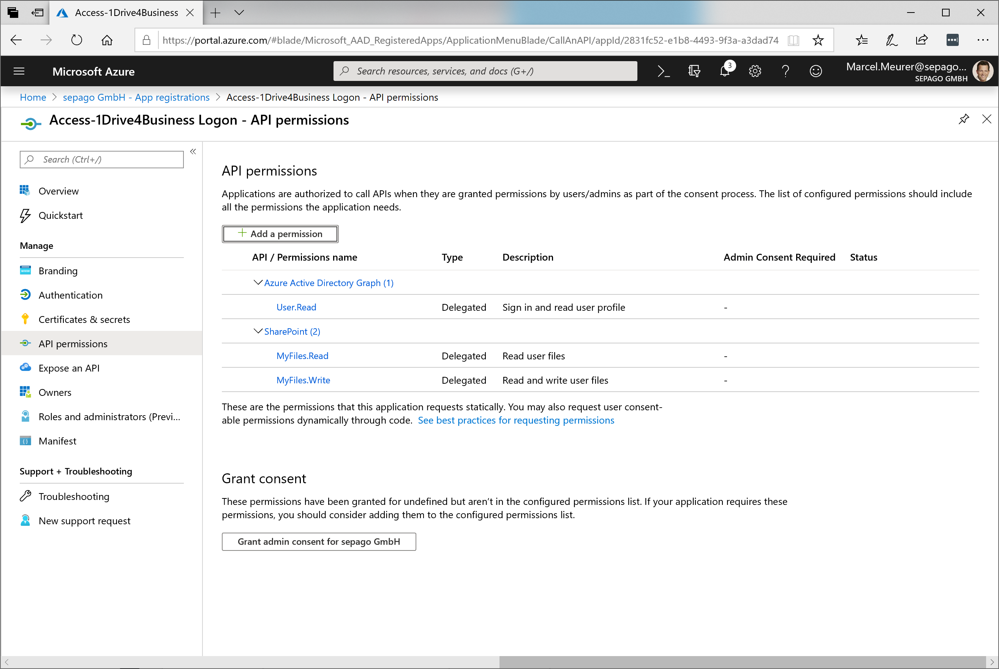
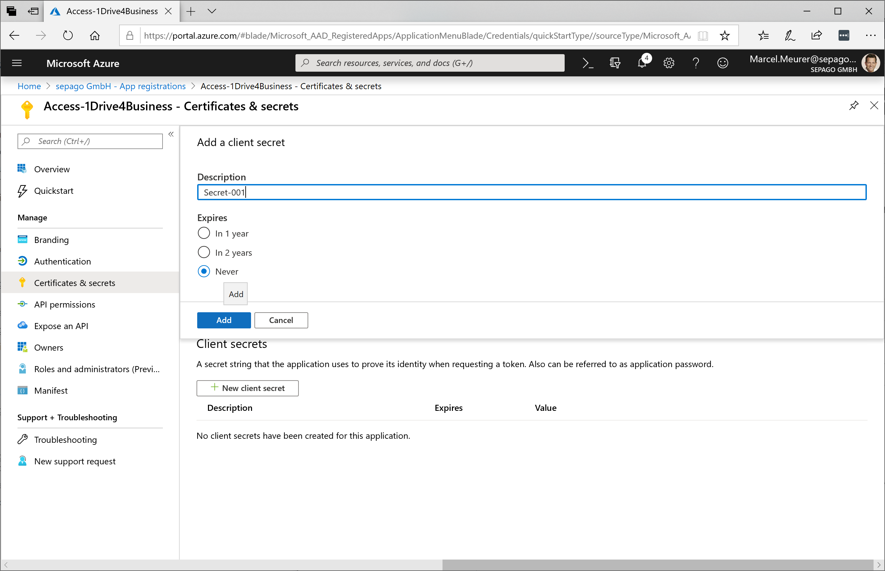
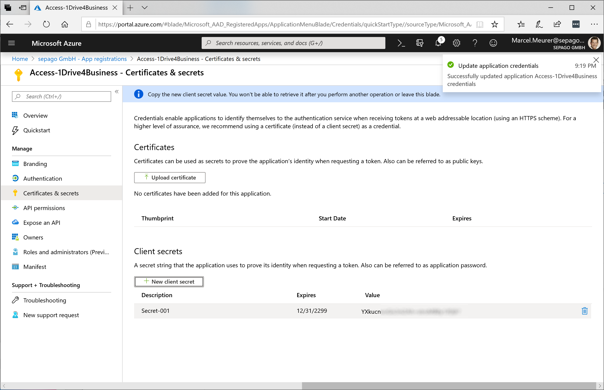

# OneDrive PowerShell Module

The OneDrive PowerShell module is available via PowerShellGallery.com. If you want to support and work with me feel free to make changes cloning this repo, change and send me and a pull request.

This OneDrive version (2.0.0 and higher in PowerShellGallery.com) supports:

- [x] OneDrive personal
- [x] OneDrive for Business


## What's new

Version 2.2.1		

- Upload support for larger files: *Add-ODItemLarge*
  Typically files larger then 10 MBytes. Uploading this files is not stable with the standard upload process used by *Add-ODItem*. Thanks to Benke Tamás (funkeninduktor@gmail.com) for sharing this function

Version 2.2.0

- Downloaded files keeping their time stamps from know
  Bevor: A downloaded file get the current time as time stamp (created at)

## Installation

Open PowerShell and

```powershell
Install-Module -Name OneDrive -Scope CurrentUser -force
```

You can update the module to a newer version with the same command (-force). After that you have to restart your PowerShell session. If you don’t use PowerShellGet currently, go to the Gallery on https://www.powershellgallery.com/packages/OneDrive and click "Get Started".

Check your installation with

```powershell
Get-Help -Name OneDrive
```

## Authentication

Before you start using the OneDrive module you have register your script/application. This differs depending on the OneDrive version to be used.

### OneDrive Personal

Read this on my blog: https://www.sepago.de/blog/onedrive-powershell-module-new-version-with-improved-authentication/

- Go to: https://apps.dev.microsoft.com and login with your Microsoft Account (MSA) and "Add an app" in the category "converged applications"
  

- Enter a name and press "create"
  

- Press "Generate New Password" and save the password (app key)
  

- Also save the "Application id"

- Press "Add Platforms" and select "Web"
  

- Check "Allow implicit Flow" and enter a "Redirect URL". This is not a real URL. Choose a localhost address and note it. In my case I chose: http://localhost/login
  
  
  
- Press "Save"

- Now you have all necessary data for your app / script:

  - Client Id: 5dd40b03-0ead-451b-b5e3-f704550e8cca
  - AppKey: xqacs8K92MuCJKgciRHQ1Cf
  - RedirectURI: http://localhost/login

- To get an authentication token use: 

  ```powershell
  $Auth=Get-ODAuthentication -ClientID 5dd40b03-0ead-451b-b5e3-f704550e8cca -AppKey "xqacs8K92MuCJKgciRHQ1Cf" -RedirectURI http://localhost/login
  ```


  


### OneDrive for Business

To use OneDrive for business you have to register your script/app to in Azure Active Directory

- Add an application in Azure Active Directory inside the Azure portal: https://portal.azure.com/#blade/Microsoft_AAD_IAM/ActiveDirectoryMenuBlade/RegisteredApps

- Chose "New registration"

- Give your application a name and configure the redirect URI. The sign-on URL has to be a valid URL but doesn't have to exist. E.g.: http://localhost/1Drive4Business (make later sure that this url is in the reply url list of your application)

  

- Click "Register" to create the Azure application.
  
- Next go to "Authentication" and enable "ID tokens" - Save the change
  

- Click on API permissions and add the following permissions:
  
- Azure Active Directory Graph - Delegated permission - User.Read
  - SharePoint - Delegated permission - MyFilesRead
  - SharePoint - Delegated permission - MyFilesWrite
  
  
  
  
  
  
- Generate a secrete key for this application and save it for later use. Also save the application Id
  
  

- You should now have the following parameter:

  - Client Id: 2831fc52-e1b8-4493-9f3a-a3dad74b2081
  - AppKey: TqoSXXXXXXXXXXXXXXXXXXXXXXXXXXXXXXXX=
  - RedirectURI: http://sepago.de/1Drive4Business

- Additionally you need the resource URL for OneDrive for Business. Normally: https://<tenant>-my.sharepoint.com/. In our company this is the URL "https://sepagogmbh-my.sharepoint.com/" (the last one / is important).

  - Resource ID: https://sepagogmbh-my.sharepoint.com/

- To get an authentication token use: 

  ```powershell
  $Auth=Get-ODAuthentication -ClientId "2831fc52-e1b8-4493-9f3a-a3dad74b2081" -AppKey "TqoSXXXXXXXXXXXXXXXXXXXXXXXXXXXXXXXX="  -RedirectURI "http://sepago.de/1Drive4Business" -ResourceId "https://sepagogmbh-my.sharepoint.com/"
  ```

### Renew the authentication with a refresh token

An access token is 1 hour valid. You can get a new access token with the refresh token provided by the last authentication. This is necessary if you are creating a script that will work for a long time without further user input. Renew your access token automatically in the program code.

```powershell
$Auth=Get-ODAuthentication -ClientId "2831fc52-e1b8-4493-9f3a-a3dad74b2081" -AppKey "TqoSXXXXXXXXXXXXXXXXXXXXXXXXXXXXXXXX=" -RedirectURI "http://sepago.de/1Drive4Business" -ResourceId "https://sepagogmbh-my.sharepoint.com/" -RefreshToken $LastAuth.refresh_token
```

- Where $LastAuth is your last authentication result (containing the refresh token)
- For OneDrive personal leave the ResourceId empty (-ResourceId "")

## Working with files and folders

Get an authentication code from above and store it in $Auth

### List files and folders

```powershell
Get-ODChildItems -AccessToken $Auth.access_token -ResourceId "https://sepagogmbh-my.sharepoint.com/" -path "/"
```

### List files and folders

```powershell
Remove-ODItem -AccessToken $Auth.access_token -ResourceId "https://sepagogmbh-my.sharepoint.com/" -path "/Upload"
```

### Creating a folder

```powershell
New-ODFolder -AccessToken $Auth.access_token -ResourceId "https://sepagogmbh-my.sharepoint.com/" -path "/" -FolderName "Upload"
```

### Upload local files to OneDrive

```powershell
Add-ODItem -AccessToken $Auth.access_token -ResourceId "https://sepagogmbh-my.sharepoint.com/" -LocalFile "D:\DEV\PowerShell\PowerShellGallery-OneDrive\Test\Uploads\IoT Workshop.pptx" -Path "/Upload" 
```

### Upload a large local files to OneDrive

```powershell
Add-ODItemLarge -AccessToken $Auth.access_token -ResourceId "https://sepagogmbh-my.sharepoint.com/" -LocalFile "D:\DEV\PowerShell\PowerShellGallery-OneDrive\Test\Uploads\IoT Workshop.mp4" -Path "/Upload" 
```

### List OneDrive drives

```powershell
Get-ODDrives -AccessToken $Auth.access_token -ResourceId "https://sepagogmbh-my.sharepoint.com/"
```

### Downloading some files

```powershell
Get-ODItem -AccessToken $Auth.access_token -ResourceId "https://sepagogmbh-my.sharepoint.com/" -Path "/Upload/Doings.txt" -LocalPath "D:\DEV\PowerShell\PowerShellGallery-OneDrive\Test\Downloads"
```

```powershell
Get-ODItem -AccessToken $Auth.access_token -ResourceId "https://sepagogmbh-my.sharepoint.com/" -Path "/Upload/Doings.txt" -LocalPath "D:\DEV\PowerShell\PowerShellGallery-OneDrive\Test\Downloads" -LocalFileName "Copy from OneDrive.Doings.txt"
```

Hint: From version 2.2 downloaded files keep their timestamp.

### Delete a file in OneDrive

```powershell
Remove-ODItem -AccessToken $Auth.access_token -ResourceId "https://sepagogmbh-my.sharepoint.com/" -Path "/Upload/Doings.txt"
```

## Working with shared/remote files and folders

Sometimes you have files and folders shared by someone others. You can list this files and download it to your local computer. To access shared files and other OneDrive drives / SharePoint **edit** your **application permission**: Add *"Read items and all site collection" below application permission* to access shared files and other OneDrive drives

### Listing files shared with me

```powershell
$sharedFiles=Get-ODSharedItems -AccessToken $Auth.access_token -ResourceId "https://sepagogmbh-my.sharepoint.com/" 

$sharedFiles | Select-Object -Property Name,size,folder
```

### Downloading a shared file

```powershell
$sharedFile=$sharedFiles[17]   # element 17; has to be a file - not a folder

Get-ODItem -AccessToken $Auth.access_token -ResourceId "https://sepagogmbh-my.sharepoint.com/" -ElementId $sharedFile.id -DriveId $sharedFile.remoteItem.parentReference.driveId
```

### Uploading a file to a shared folder

This can be a shared folder from a user or from SharePoint

```powershell
$sharedFolder=$sharedFiles[1] # where element 1 is a folder shared with you

Add-ODItem -AccessToken $at -ResourceId $resourceIdGiven -LocalFile "D:\DEV\PowerShell\PowerShellGallery-OneDrive\Test\Uploads\Doings.txt" -DriveId $sharedFolder.remoteItem.parentReference.driveId -ElementId $sharedFolder.Id
```

### Downloading files from OneDrive recursively

Copy files recursively from OneDrive to a local folder

```powershell
function Transfer-Files ($path)
{
	$Content=@(Get-ODChildItems -AccessToken $at -ResourceId $resourceIdGiven -Path $path)
	$CountFiles=@($Content|where {!$_.folder}).count
	$CountFolders=@($Content|where {$_.folder}).count
	if ($Verbose) {write-host("Current folder: '"+$path+"' (contains folders/files: "+$CountFolders+"/"+$CountFiles+")")}
	$global:AllFiles+=$CountFiles
	$global:AllFolders+=$CountFolders
	$ErrorActionPreference = "Stop"
	foreach ($entry in $content)
	{
		if ($entry.folder)
		{
			if ($Verbose) {write-host ("Found folder '"+$entry.name+"'")}
			$NewPath=($path+"/"+$entry.name).Replace("//","/")
			$NewLocalPath=$TargetPath+$NewPath.Replace("/","\")
			if ($Verbose) {write-host ("Create local folder '"+$NewLocalPath+"'")}
			if (!$demo) {New-Item -ItemType directory -Path $NewLocalPath -force | out-null}
			Transfer-Files($NewPath)
			
		} else
		{
			$LocalPath=$TargetPath+$path.Replace("/","\")
			if ($Verbose) {write-host("Download file "+$entry.name+ " to "+$LocalPath)}
			if (!$demo) {$ReturnCode=Get-ODItem -AccessToken $at -ResourceId $resourceIdGiven -ElementID $entry.id -LocalPath $LocalPath}
			$global:size+=$entry.size
		}
	}
}

$global:size=0
$global:AllFiles=0
$global:AllFolders=0
$Verbose=$true
$TargetPath="D:\DEV\PowerShell\PowerShellGallery-OneDrive\Test\Downloads\Backup"

Transfer-Files "\Working Folder\Data Analytics"
	
write-host ("Number of files:    "+$global:AllFiles)
write-host ("Number of folders:  "+$global:AllFolders)
write-host ("Bytes transfered:   {0:N0}" -f $global:Size)
```

### List OneDrive drives

```powershell
$Drives=Get-ODDrives -AccessToken $Auth.access_token -ResourceId "https://sepagogmbh-my.sharepoint.com/"
```

### List content of other OneDrive drives

```powershell
$Drives=Get-ODDrives -AccessToken $Auth.access_token -ResourceId "https://sepagogmbh-my.sharepoint.com/"
Get-ODChildItems -AccessToken $at -ResourceId $resourceIdGiven -DriveId $Drives[0].id -Path "/Profilbilder"
```

## Remarks

Links:

- My blog: https://www.sepago.de/blog/author/marcel-meurer/
- Linked-in:  https://www.linkedin.com/in/marcel-meurer-15b46b98/
- Twitter: https://twitter.com/MarcelMeurer
- About me / imprint: https://about.me/marcel.meurer


Feel free to contribute. If you want to stay informed follow this GitHub repo and me on Twitter: https://twitter.com/MarcelMeurer

